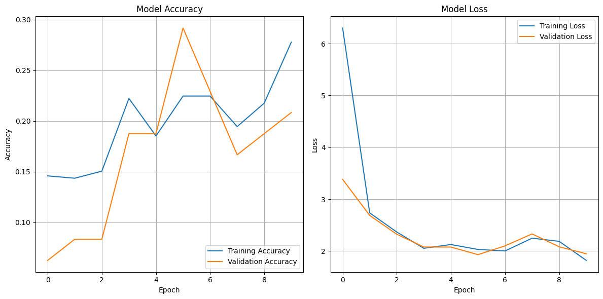
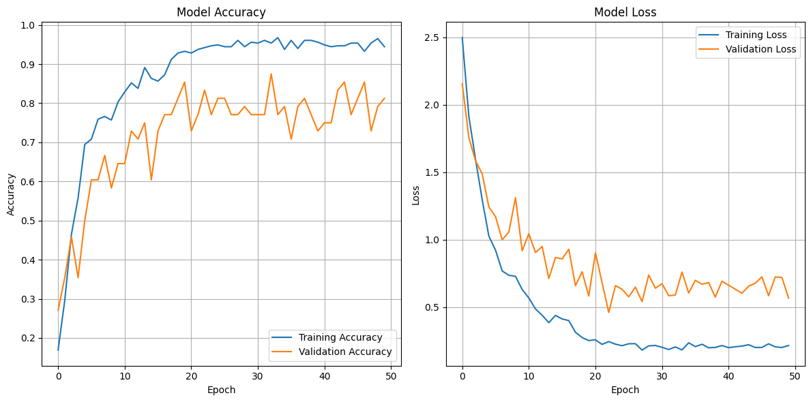
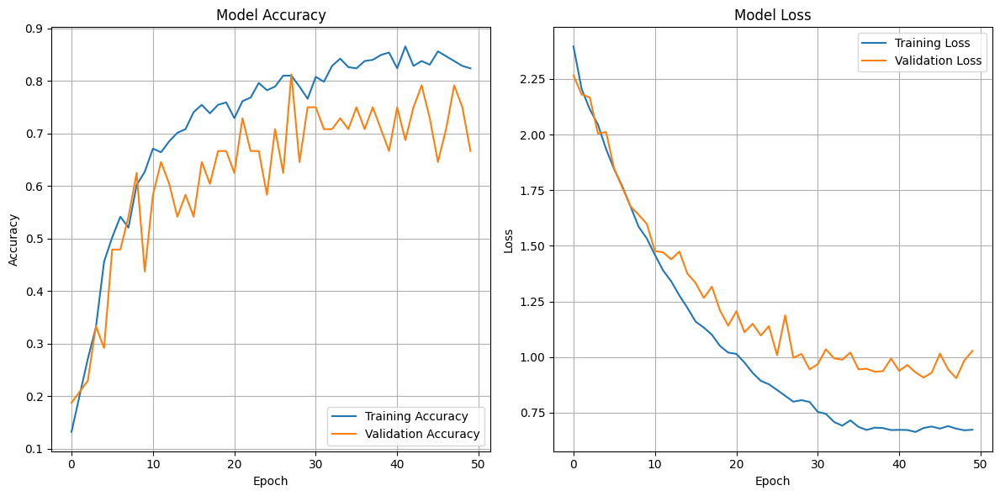

# Model Hyperparameter Testing and Evaluation

- Mario Dorado Martínez
- Marta Jover Valero

In this document, we outline the experiments conducted to evaluate the performance of a neural network model by testing different hyperparameters. The goal is to assess how varying the `learning rate`, number of `epochs`, and `batch size` affects the model's _accuracy_ and _loss_.

## 1. Hyperparameters Tested

The following hyperparameters were tested in our experiments:

### Learning Rate

The learning rate determines the size of the steps the optimizer takes during training. A small learning rate might slow down the training, while a large learning rate could result in overshooting the optimal solution.

- **Values tested**: 
    - `0.1`
    - `0.01`
    - `0.001`

### Epochs

The number of epochs indicates how many times the model will go through the entire training dataset.

- **Values tested**: 
    - `10`
    - `20`
    - `50`

### Batch Size

The batch size controls how many samples are processed before updating the model weights.

- **Values tested**:
    - `32`
    - `64`
    - `128`

## 2. Experiment Setup

For each combination of these hyperparameters, the model was trained and evaluated. The following metrics were recorded for each experiment:

- **Training accuracy** and **validation accuracy**
- **Training loss** and **validation loss**

Each experiment was repeated to ensure robustness and to avoid `overfitting` or `random fluctuations` in performance. 

## 3. Results Overview

The results of the experiments are summarized in the following sections. For each combination of hyperparameters, the following visualizations were generated:

1. **Training and Validation Loss/Accuracy Graph**: A plot showing the training and validation loss/accuracy over epochs.
2. **Predictions Grid**: A grid of images showing the predicted labels versus the true labels for a subset of test images.

## 4. Example Test Results

### Test 1: Learning Rate = 0.1, Epochs = 10, Batch Size = 32

> This test explores the impact of a **high learning rate** (0.1) on training with **few epochs** (10) and a **small batch size** (32). The aim is to evaluate if the model can converge quickly with such an aggressive learning rate and limited epochs, but also to see if it might lead to instability or suboptimal performance due to the large update steps in each iteration.

- **Training Accuracy**: 27.8%
- **Validation Accuracy**:  20.8%
- **Training Loss**: 1.82
- **Validation Loss**: 1.95

#### Training and Validation Accuracy Plot:

#### Predicted vs True Labels:

#### Conclusion

- The model has been training for 10 minutes.
- Posible Underfitting: validation accuracy below 60%.

---

### Test 2: Learning Rate = 0.01, Epochs = 50, Batch Size = 64

> This test examines the behavior of the model with a **moderate learning rate** (0.01) and a **larger number of epochs** (50) for training. A **medium batch size** (64) is used to balance training speed and stability. The objective is to see if a smaller learning rate combined with more epochs helps the model converge more smoothly and reach higher accuracy without overfitting.

- **Training Accuracy**: 94.4%
- **Validation Accuracy**: 81.2%
- **Training Loss**: 0.22
- **Validation Loss**: 0.57

#### Training and Validation Accuracy Plot:

#### Predicted vs True Labels:

#### Conclusion

- The model has been training for 45 minutes and 37 seconds.
- The model seems to be well fitted.

### Test 3: Learning Rate = 0.001, Epochs = 50, Batch Size = 128

> In this test, the **learning rate** is set to a **very low value** (0.001) and the number of **epochs** is set to 50, with a **large batch size** (128). The goal is to investigate whether a smaller learning rate allows for a more gradual and stable convergence and whether a larger batch size speeds up training without compromising the model's ability to generalize. This configuration aims to find the optimal trade-off between stable learning and training efficiency.

- **Training Accuracy**: 93.5%
- **Validation Accuracy**: 90.2%
- **Training Loss**: 0.22
- **Validation Loss**: 0.30

#### Training and Validation Accuracy Plot:

#### Predicted vs True Labels:

#### Conclusion

- The model has been training for 42 minutes and 36 seconds.
- The model seems to be well fitted.

---

## 5. Conclusion

Based on the hyperparameter testing, we observed the following trends and insights:

### Learning Rate:

A high learning rate (0.1) leads to faster training but increases the risk of instability and poor convergence, as seen in Test 1. This resulted in low accuracy and high loss, indicative of underfitting.

A moderate learning rate (0.01) provided a balance between training speed and model performance. It allowed the model to converge effectively within 50 epochs without overfitting, as shown in Test 2.

A low learning rate (0.001) enabled more gradual and stable convergence, achieving the highest validation accuracy (90.2%) in Test 3. However, the training process was slower compared to a moderate learning rate.

### Epochs:

Fewer epochs (10) were insufficient for the model to learn complex patterns, especially with a high learning rate, leading to poor generalization.

Increasing the number of epochs (50) allowed the model to achieve better performance, particularly with lower learning rates, as it had more opportunities to refine the weights and reduce loss.

### Batch Size:

Smaller batch sizes (32) provided noisier gradient updates but were computationally more intensive for the same number of epochs, resulting in slower training times.

Medium batch sizes (64) offered a good trade-off between stability and training efficiency, as evidenced in Test 2.

Larger batch sizes (128) sped up training by processing more data per update but required a carefully tuned learning rate to prevent poor generalization. Test 3 demonstrated that with an appropriately low learning rate, a larger batch size can achieve excellent results.

### Final Recommendations

For faster convergence with good performance, learning rate = 0.01, epochs = 50, and batch size = 64 are recommended.

For optimal performance with more computational resources, learning rate = 0.001, epochs = 50, and batch size = 128 provide the best results, as seen in Test 3.

Avoid using a high learning rate (0.1) unless the dataset and model architecture can tolerate it, as it often leads to instability and underfitting.